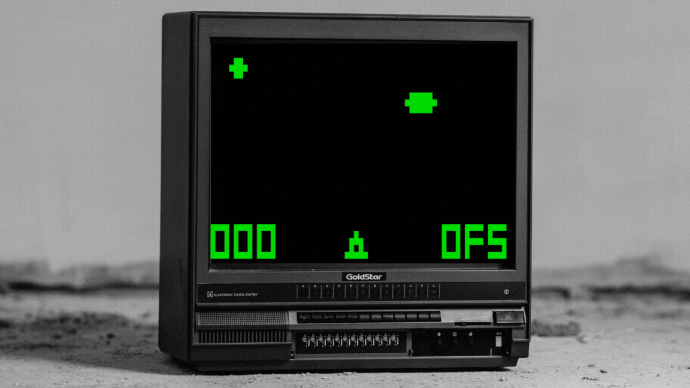

# The chip8-emu is emulator for chip8



## Introduction

This project is a Chip8 emulator written in the Rust language. Chip8 is an interpreted programming language, developed in the mid-1970s, used on some microcomputers to make game programming easier. Our emulator replicates the functionality of the Chip8 system, allowing users to run Chip8 programs, including classic games like Pong, Tetris, and Space Invaders.

## Features

- Accurate emulation of the Chip8 processor.
- Support for loading and running Chip8 ROMs.
- Customizable settings
- Graphical user interface for easy interaction with the emulator.

## Instructions
> ⚠️ **The games are located in the ```assets``` folder**

1. Download and unpack app or clone and build. (Currently the build only works on Windows, but you can modify the build.rs for Linux and Mac OS)
2. Run game: ```chip8-emu --rom-path "path to game"```


## License

This project is licensed under the MIT license - see the LICENSE file for details.